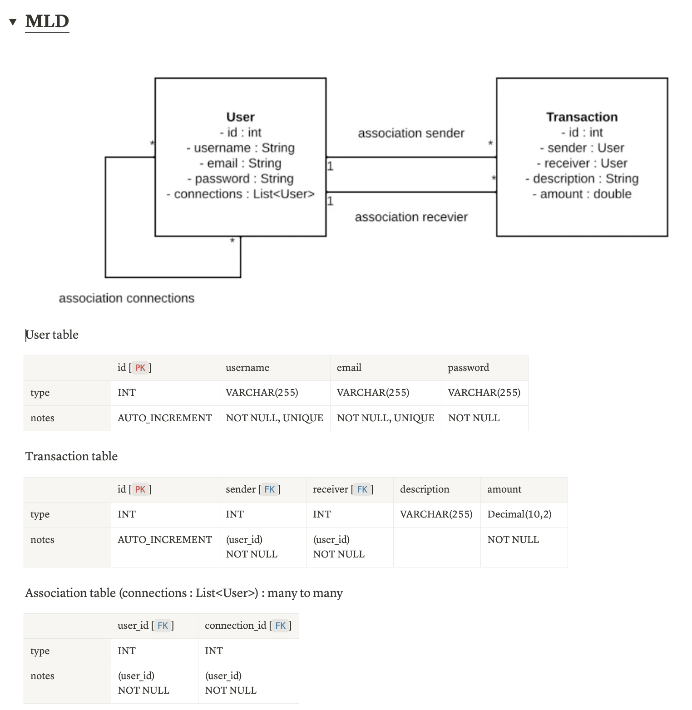

# Pay My Buddy

### MLD



------
### MPD

```SQL
CREATE DATABASE PayMyBuddy;

CREATE TABLE user (
             id INT AUTO_INCREMENT PRIMARY KEY,
             username VARCHAR(255) NOT NULL UNIQUE,
             email VARCHAR(255) NOT NULL UNIQUE,
             password VARCHAR(255) NOT NULL
);

CREATE TABLE transaction (
             id INT AUTO_INCREMENT PRIMARY KEY,
             sender_id INT NOT NULL,
             receiver_id INT NOT NULL,
             description TEXT NULL,
             amount DECIMAL(10,2) NOT NULL,
             FOREIGN KEY (sender_id) REFERENCES user(id),
             FOREIGN KEY (receiver_id) REFERENCES user(id)
);

CREATE TABLE user_connections (
             user_id INT NOT NULL,
             connection_id INT NOT NULL,
             PRIMARY KEY (user_id, connection_id),
             FOREIGN KEY (user_id) REFERENCES user(id),
             FOREIGN KEY (connection_id) REFERENCES user(id)
);
```
-------
